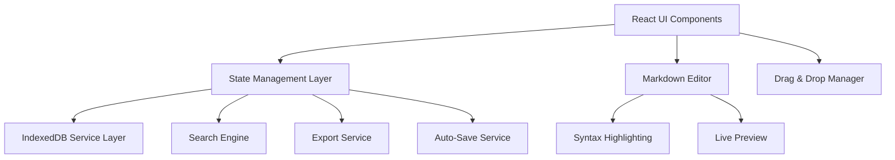

# Design Document

## Overview

DevNotes is a client-side web application built with React 18+ and TypeScript, utilizing IndexedDB for local data persistence. The application follows a component-based architecture with a clear separation of concerns between UI components, business logic, and data management. The design emphasizes performance, accessibility, and developer experience while maintaining a clean, intuitive interface.

## Architecture

### High-Level Architecture



### Technology Stack

- **Frontend Framework**: React 18+ with TypeScript
- **Build Tool**: Vite with TypeScript configuration
- **Styling**: Tailwind CSS v3+ with shadcn/ui components
- **State Management**: Zustand for global state
- **Data Persistence**: IndexedDB with Dexie.js wrapper
- **Markdown Processing**: Unified.js ecosystem (remark/rehype)
- **Code Highlighting**: Prism.js or Shiki
- **Math Rendering**: KaTeX
- **Diagram Rendering**: Mermaid
- **Icons**: Lucide React
- **Typography**: Geist and Geist Mono fonts

### Project Structure

```
src/
├── components/
│   ├── ui/                 # shadcn/ui base components
│   ├── layout/            # Layout components (Sidebar, Header)
│   ├── navigation/        # Folder tree, note list
│   ├── editor/            # Markdown editor components
│   ├── search/            # Search interface components
│   └── modals/            # Dialogs and overlays
├── hooks/                 # Custom React hooks
├── lib/
│   ├── db/               # IndexedDB service layer
│   ├── search/           # Search engine implementation
│   ├── export/           # Export functionality
│   └── utils/            # Utility functions
├── stores/               # Zustand stores
├── types/                # TypeScript type definitions
└── styles/               # Global styles and Tailwind config
```

## Components and Interfaces

### Core Data Models

```typescript
// Core entity interfaces
interface Note {
  id: string;
  title: string;
  content: string;
  folderId: string;
  createdAt: Date;
  updatedAt: Date;
  tags: string[];
  wordCount: number;
  readingTime: number;
  isDeleted?: boolean;
  deletedAt?: Date;
}

interface Folder {
  id: string;
  name: string;
  parentId: string | null;
  children: string[];
  notes: string[];
  createdAt: Date;
  updatedAt: Date;
  isExpanded: boolean;
  isDeleted?: boolean;
  deletedAt?: Date;
}

interface Tag {
  id: string;
  name: string;
  color: string;
  createdAt: Date;
  updatedAt: Date;
  noteCount: number;
}

interface SearchResult {
  noteId: string;
  title: string;
  snippet: string;
  matchCount: number;
  folderPath: string;
  lastModified: Date;
  highlights: SearchHighlight[];
  tags: string[];
}

interface SearchHighlight {
  start: number;
  end: number;
  text: string;
}

interface SearchFilters {
  folderId?: string;
  tags?: string[];
  dateRange?: {
    start: Date;
    end: Date;
  };
  sortBy: 'relevance' | 'date' | 'title';
  sortOrder: 'asc' | 'desc';
}

interface GuideSection {
  id: string;
  title: string;
  content: string;
  category: 'getting-started' | 'features' | 'advanced' | 'troubleshooting';
  order: number;
  searchKeywords: string[];
}

interface GuideSearchResult {
  sectionId: string;
  title: string;
  snippet: string;
  category: string;
  matchScore: number;
}
```

### State Management Architecture

The application uses a distributed Zustand store architecture with specialized stores for different domains:

```typescript
// Distributed store architecture
interface AppStore {
  // Initialization and coordination
  initialize: () => Promise<void>;
  isInitialized: boolean;
}

interface NoteStore {
  notes: Record<string, Note>;
  createNote: (folderId: string, title?: string) => Promise<string>;
  updateNote: (id: string, updates: Partial<Note>) => Promise<void>;
  deleteNote: (id: string) => Promise<void>;
  moveNote: (noteId: string, targetFolderId: string) => Promise<void>;
  duplicateNote: (noteId: string) => Promise<string>;
}

interface FolderStore {
  folders: Record<string, Folder>;
  createFolder: (parentId: string | null, name: string) => Promise<string>;
  updateFolder: (id: string, updates: Partial<Folder>) => Promise<void>;
  deleteFolder: (id: string) => Promise<void>;
  moveFolder: (folderId: string, targetParentId: string | null) => Promise<void>;
}

interface UIStore {
  selectedNoteId: string | null;
  selectedFolderId: string | null;
  sidebarWidth: number;
  isDarkMode: boolean;
  panelLayout: 'split' | 'editor' | 'preview';
  isSidebarCollapsed: boolean;
  saveStatus: 'idle' | 'saving' | 'saved' | 'error';
}

interface SearchStore {
  searchQuery: string;
  searchResults: SearchResult[];
  recentNotes: Note[];
  searchFilters: SearchFilters;
  search: (query: string) => Promise<SearchResult[]>;
  clearSearch: () => void;
}

interface TagStore {
  tags: Record<string, Tag>;
  createTag: (name: string, color?: string) => Promise<string>;
  updateTag: (id: string, updates: Partial<Tag>) => Promise<void>;
  deleteTag: (id: string) => Promise<void>;
  addTagToNote: (noteId: string, tagId: string) => Promise<void>;
  removeTagFromNote: (noteId: string, tagId: string) => Promise<void>;
}

interface UserGuideStore {
  isOpen: boolean;
  currentSection: string | null;
  searchQuery: string;
  searchResults: GuideSearchResult[];
  lastViewedSection: string | null;
}
```

### Component Architecture

#### Layout Components

**AppLayout**
- Main application container
- Manages panel resizing
- Handles responsive behavior
- Provides keyboard shortcuts context

**Sidebar**
- Contains folder tree and search
- Resizable with drag handle
- Collapsible on mobile
- Persistent width preferences

**MainPanel**
- Note editor and preview area
- Responsive layout switching
- Toolbar integration

#### Navigation Components

**FolderTree**
- Hierarchical folder display
- Drag-and-drop support
- Context menu integration
- Virtual scrolling for large trees

**NoteList**
- Filtered note display
- Search result highlighting
- Sorting and grouping options
- Virtual scrolling for performance

#### Editor Components

**MarkdownEditor**
- CodeMirror 6 integration
- Real-time syntax highlighting
- Auto-completion support
- Vim/Emacs key bindings option

**PreviewPane**
- Live markdown rendering
- Code syntax highlighting
- Math expression rendering
- Mermaid diagram support
- Synchronized scrolling

**EditorToolbar**
- Formatting buttons
- Insert helpers (tables, links)
- Preview toggle
- Word count display

### Data Management Layer

#### IndexedDB Service

```typescript
class DatabaseService {
  private db: Dexie;
  
  constructor() {
    this.db = new Dexie('DevNotesDB');
    this.db.version(1).stores({
      notes: '++id, title, content, folderId, createdAt, updatedAt',
      folders: '++id, name, parentId, createdAt, updatedAt',
      settings: '++key, value'
    });
  }
  
  // Note operations
  async createNote(note: Omit<Note, 'id'>): Promise<string>;
  async updateNote(id: string, updates: Partial<Note>): Promise<void>;
  async deleteNote(id: string): Promise<void>;
  async getNoteById(id: string): Promise<Note | undefined>;
  async getNotesByFolder(folderId: string): Promise<Note[]>;
  async getAllNotes(): Promise<Note[]>;
  
  // Folder operations
  async createFolder(folder: Omit<Folder, 'id'>): Promise<string>;
  async updateFolder(id: string, updates: Partial<Folder>): Promise<void>;
  async deleteFolder(id: string): Promise<void>;
  async getFolderById(id: string): Promise<Folder | undefined>;
  async getAllFolders(): Promise<Folder[]>;
  
  // Search operations
  async searchNotes(query: string): Promise<SearchResult[]>;
  
  // Bulk operations
  async exportData(): Promise<ExportData>;
  async importData(data: ExportData): Promise<void>;
}
```

#### Auto-Save Service

```typescript
class AutoSaveService {
  private saveQueue: Map<string, NodeJS.Timeout> = new Map();
  private readonly SAVE_DELAY = 500; // ms
  
  scheduleAutoSave(noteId: string, content: string): void {
    // Cancel existing timeout
    const existingTimeout = this.saveQueue.get(noteId);
    if (existingTimeout) {
      clearTimeout(existingTimeout);
    }
    
    // Schedule new save
    const timeout = setTimeout(async () => {
      await this.saveNote(noteId, content);
      this.saveQueue.delete(noteId);
    }, this.SAVE_DELAY);
    
    this.saveQueue.set(noteId, timeout);
  }
  
  private async saveNote(noteId: string, content: string): Promise<void> {
    // Implementation with error handling and conflict resolution
  }
  
  async forceSave(noteId: string): Promise<void> {
    // Immediate save for explicit user actions
  }
}
```

### Search Engine Implementation

```typescript
class SearchEngine {
  private index: Map<string, SearchIndex> = new Map();
  
  async indexNote(note: Note): Promise<void> {
    const tokens = this.tokenize(note.content + ' ' + note.title);
    const index: SearchIndex = {
      noteId: note.id,
      tokens: tokens,
      title: note.title,
      folderId: note.folderId
    };
    this.index.set(note.id, index);
  }
  
  async search(query: string): Promise<SearchResult[]> {
    const queryTokens = this.tokenize(query);
    const results: SearchResult[] = [];
    
    for (const [noteId, index] of this.index) {
      const score = this.calculateRelevanceScore(queryTokens, index);
      if (score > 0) {
        const result = await this.createSearchResult(noteId, query, score);
        results.push(result);
      }
    }
    
    return results.sort((a, b) => b.matchCount - a.matchCount);
  }
  
  private tokenize(text: string): string[] {
    // Advanced tokenization with stemming and stop word removal
  }
  
  private calculateRelevanceScore(queryTokens: string[], index: SearchIndex): number {
    // TF-IDF or similar scoring algorithm
  }
}
```

## Data Models

### Database Schema

```typescript
// IndexedDB schema definition
interface DatabaseSchema {
  notes: {
    key: string;
    value: Note;
    indexes: {
      folderId: string;
      createdAt: Date;
      updatedAt: Date;
      title: string;
    };
  };
  
  folders: {
    key: string;
    value: Folder;
    indexes: {
      parentId: string | null;
      name: string;
      createdAt: Date;
    };
  };
  
  settings: {
    key: string;
    value: {
      key: string;
      value: any;
    };
  };
  
  searchIndex: {
    key: string;
    value: {
      noteId: string;
      tokens: string[];
      lastIndexed: Date;
    };
  };
}
```

### Export/Import Data Structure

```typescript
interface ExportData {
  version: string;
  exportDate: Date;
  notes: Note[];
  folders: Folder[];
  settings: Record<string, any>;
  metadata: {
    totalNotes: number;
    totalFolders: number;
    exportFormat: 'json' | 'zip';
  };
}
```

## Error Handling

### Error Boundary Strategy

```typescript
class AppErrorBoundary extends React.Component<Props, State> {
  constructor(props: Props) {
    super(props);
    this.state = { hasError: false, error: null };
  }
  
  static getDerivedStateFromError(error: Error): State {
    return { hasError: true, error };
  }
  
  componentDidCatch(error: Error, errorInfo: React.ErrorInfo) {
    // Log error to local storage for debugging
    this.logError(error, errorInfo);
  }
  
  render() {
    if (this.state.hasError) {
      return <ErrorFallback error={this.state.error} />;
    }
    
    return this.props.children;
  }
}
```

### Database Error Handling

```typescript
class DatabaseErrorHandler {
  static async handleDatabaseError(error: Error, operation: string): Promise<void> {
    console.error(`Database operation failed: ${operation}`, error);
    
    if (error.name === 'QuotaExceededError') {
      // Handle storage quota exceeded
      await this.handleStorageQuotaExceeded();
    } else if (error.name === 'VersionError') {
      // Handle database version conflicts
      await this.handleVersionConflict();
    } else {
      // Generic error handling
      this.showErrorNotification(error.message);
    }
  }
  
  private static async handleStorageQuotaExceeded(): Promise<void> {
    // Implement cleanup strategies
  }
}
```

### User Guide System

The application includes a comprehensive user guide system with contextual help and searchable documentation.

#### User Guide Architecture

```typescript
class UserGuideService {
  private content: Map<string, GuideSection> = new Map();
  private searchIndex: SearchIndex;
  
  async loadContent(): Promise<void> {
    // Load markdown content files at build time
    const contentModules = import.meta.glob('/src/content/userGuide/markdown/**/*.md');
    for (const [path, loader] of Object.entries(contentModules)) {
      const module = await loader();
      const section = this.parseMarkdownSection(module.default, path);
      this.content.set(section.id, section);
    }
    this.buildSearchIndex();
  }
  
  search(query: string): GuideSearchResult[] {
    return this.searchIndex.search(query);
  }
  
  getSection(id: string): GuideSection | null {
    return this.content.get(id) || null;
  }
}
```

#### Contextual Help System

```typescript
interface TooltipConfig {
  id: string;
  title: string;
  content: string;
  placement: 'top' | 'bottom' | 'left' | 'right';
  trigger: 'hover' | 'focus' | 'click';
  delay?: number;
}

const withTooltip = <P extends object>(
  Component: React.ComponentType<P>,
  config: TooltipConfig
) => {
  return React.forwardRef<any, P>((props, ref) => (
    <UserGuideTooltip config={config}>
      <Component {...props} ref={ref} />
    </UserGuideTooltip>
  ));
};
```

#### Content Structure

```
src/content/userGuide/markdown/
├── getting-started/
│   ├── welcome.md
│   ├── first-note.md
│   └── organizing-notes.md
├── features/
│   ├── markdown-editor.md
│   ├── search.md
│   ├── export-import.md
│   └── keyboard-shortcuts.md
├── advanced/
│   ├── power-user-tips.md
│   ├── customization.md
│   └── data-management.md
└── troubleshooting/
    ├── common-issues.md
    ├── performance.md
    ├── data-recovery.md
    └── memory-management.md
```

### Tag Management System

The application includes a comprehensive tag system for categorizing and filtering notes.

#### Tag Service Implementation

```typescript
class TagService {
  private db: DatabaseService;
  
  async createTag(name: string, color?: string): Promise<Tag> {
    const tag: Omit<Tag, 'id'> = {
      name: name.trim().toLowerCase(),
      color: color || this.generateRandomColor(),
      createdAt: new Date(),
      updatedAt: new Date(),
      noteCount: 0
    };
    
    const id = await this.db.tags.add(tag);
    return { ...tag, id };
  }
  
  async addTagToNote(noteId: string, tagId: string): Promise<void> {
    const note = await this.db.notes.get(noteId);
    if (note && !note.tags.includes(tagId)) {
      note.tags.push(tagId);
      await this.db.notes.update(noteId, { tags: note.tags });
      await this.updateTagCount(tagId, 1);
    }
  }
  
  async getPopularTags(limit: number = 10): Promise<Tag[]> {
    return this.db.tags
      .orderBy('noteCount')
      .reverse()
      .limit(limit)
      .toArray();
  }
}
```

## Testing Strategy

### Unit Testing Approach

**Database Layer Testing**
- Mock IndexedDB using fake-indexeddb
- Test CRUD operations with edge cases
- Verify data integrity and constraints
- Test migration scenarios

**Component Testing**
- React Testing Library for component behavior
- Mock external dependencies (database, search)
- Test user interactions and accessibility
- Snapshot testing for UI consistency

**Hook Testing**
- Test custom hooks in isolation
- Verify state management logic
- Test async operations and error handling

### Integration Testing

**End-to-End Workflows**
- Note creation and editing flow
- Folder management operations
- Search functionality
- Drag-and-drop operations
- Export/import processes

**Performance Testing**
- Large dataset handling (1000+ notes)
- Search performance benchmarks
- Auto-save performance under load
- Memory usage monitoring

### Accessibility Testing

**Automated Testing**
- axe-core integration for WCAG compliance
- Keyboard navigation testing
- Screen reader compatibility
- Color contrast validation

**Manual Testing**
- Real screen reader testing
- Keyboard-only navigation
- High contrast mode support
- Zoom level compatibility

## Performance Optimizations

### Code Splitting Strategy

```typescript
// Route-based code splitting
const Editor = lazy(() => import('./components/editor/MarkdownEditor'));
const Search = lazy(() => import('./components/search/SearchInterface'));

// Feature-based splitting
const ExportModal = lazy(() => import('./components/modals/ExportModal'));
const ImportModal = lazy(() => import('./components/modals/ImportModal'));
```

### Virtual Scrolling Implementation

```typescript
// For large note lists and folder trees
const VirtualizedNoteList: React.FC<Props> = ({ notes, height }) => {
  const rowRenderer = useCallback(({ index, key, style }) => (
    <div key={key} style={style}>
      <NoteListItem note={notes[index]} />
    </div>
  ), [notes]);
  
  return (
    <FixedSizeList
      height={height}
      itemCount={notes.length}
      itemSize={60}
      itemData={notes}
    >
      {rowRenderer}
    </FixedSizeList>
  );
};
```

### Debounced Operations

```typescript
// Auto-save and search debouncing
const useDebounce = <T>(value: T, delay: number): T => {
  const [debouncedValue, setDebouncedValue] = useState<T>(value);
  
  useEffect(() => {
    const handler = setTimeout(() => {
      setDebouncedValue(value);
    }, delay);
    
    return () => {
      clearTimeout(handler);
    };
  }, [value, delay]);
  
  return debouncedValue;
};
```

## Security Considerations

### Content Security Policy

```typescript
// CSP headers for production deployment
const cspDirectives = {
  'default-src': ["'self'"],
  'script-src': ["'self'", "'unsafe-inline'"], // For inline styles in development
  'style-src': ["'self'", "'unsafe-inline'", 'fonts.googleapis.com'],
  'font-src': ["'self'", 'fonts.gstatic.com'],
  'img-src': ["'self'", 'data:', 'blob:'],
  'connect-src': ["'self'"],
  'object-src': ["'none'"],
  'base-uri': ["'self'"],
  'form-action': ["'self'"]
};
```

### Data Sanitization

```typescript
// Sanitize user input for XSS prevention
import DOMPurify from 'dompurify';

const sanitizeMarkdown = (content: string): string => {
  return DOMPurify.sanitize(content, {
    ALLOWED_TAGS: ['p', 'br', 'strong', 'em', 'code', 'pre', 'h1', 'h2', 'h3', 'h4', 'h5', 'h6', 'ul', 'ol', 'li', 'blockquote', 'a', 'img', 'table', 'thead', 'tbody', 'tr', 'th', 'td'],
    ALLOWED_ATTR: ['href', 'src', 'alt', 'title', 'class']
  });
};
```

## Deployment Architecture

### Build Configuration

```typescript
// Vite configuration for optimal production builds
export default defineConfig({
  build: {
    target: 'es2020',
    minify: 'terser',
    sourcemap: true,
    rollupOptions: {
      output: {
        manualChunks: {
          vendor: ['react', 'react-dom'],
          editor: ['@codemirror/state', '@codemirror/view'],
          markdown: ['unified', 'remark-parse', 'rehype-stringify']
        }
      }
    }
  },
  optimizeDeps: {
    include: ['react', 'react-dom', 'zustand']
  }
});
```

### Progressive Web App Features

```typescript
// Service worker for offline functionality
const CACHE_NAME = 'devnotes-v1';
const urlsToCache = [
  '/',
  '/static/js/bundle.js',
  '/static/css/main.css',
  '/manifest.json'
];

self.addEventListener('install', (event) => {
  event.waitUntil(
    caches.open(CACHE_NAME)
      .then((cache) => cache.addAll(urlsToCache))
  );
});

self.addEventListener('fetch', (event) => {
  event.respondWith(
    caches.match(event.request)
      .then((response) => {
        return response || fetch(event.request);
      })
  );
});
```