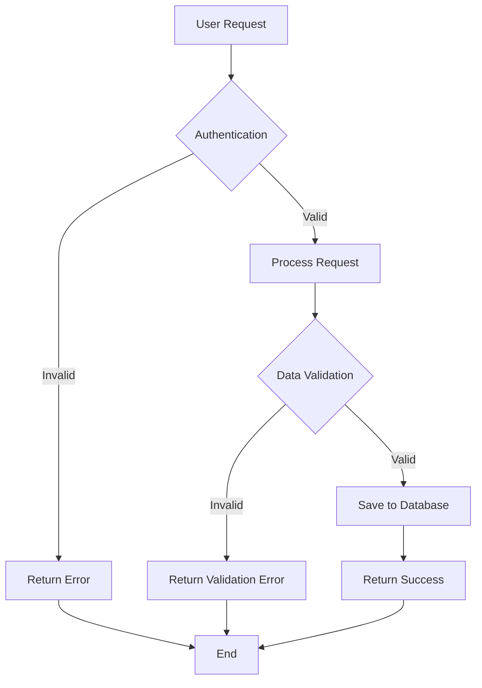
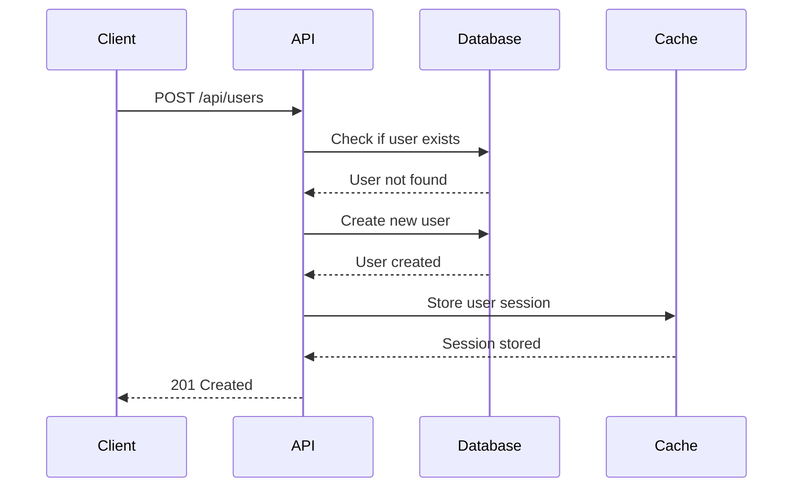
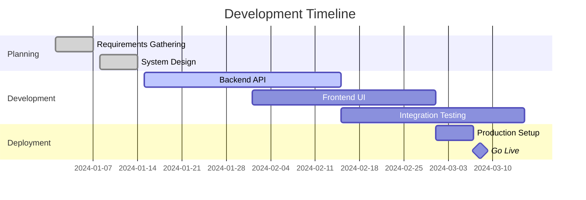
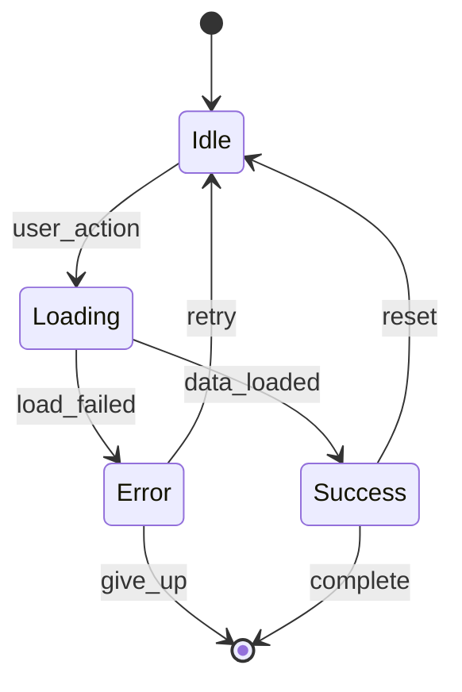
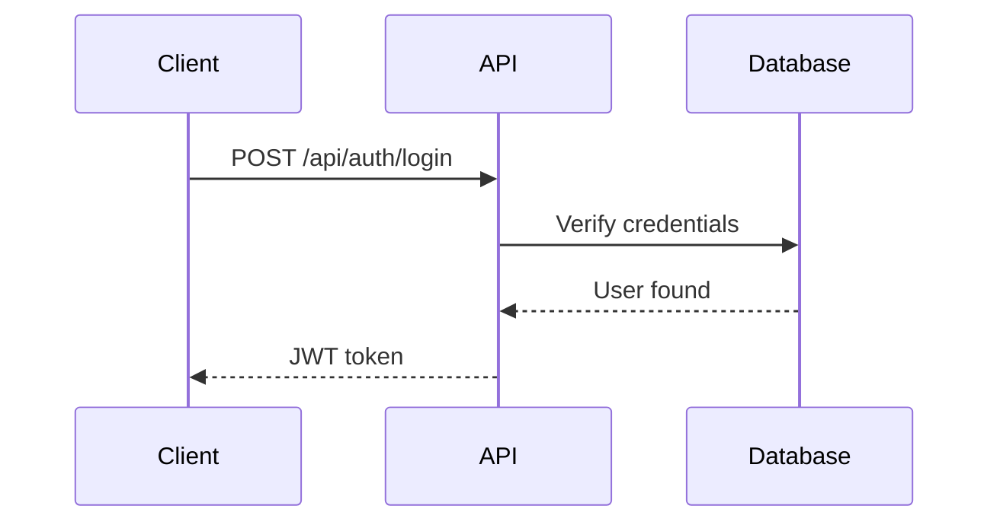
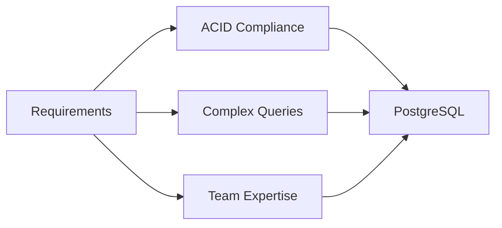

# Markdown Editor

DevNotes features a powerful markdown editor with syntax highlighting, live preview, and developer-focused enhancements.

## Editor Layout

### Split View (Default)
- **Left pane**: Markdown editor with syntax highlighting
- **Right pane**: Live preview of rendered content
- **Splitter**: Drag to adjust pane sizes

### View Modes
Switch between different view modes using the toolbar or keyboard shortcuts:

- **Split View**: `Ctrl+Shift+S` - Editor and preview side by side
- **Editor Only**: `Ctrl+Shift+E` - Focus on writing
- **Preview Only**: `Ctrl+Shift+P` - Focus on reading

## Markdown Syntax

### Headers
```markdown
# Header 1
## Header 2
### Header 3
#### Header 4
##### Header 5
###### Header 6
```

### Text Formatting
```markdown
**Bold text**
*Italic text*
***Bold and italic***
~~Strikethrough~~
`Inline code`
```

### Lists

#### Unordered Lists
```markdown
- Item 1
- Item 2
  - Nested item 2.1
  - Nested item 2.2
- Item 3
```

#### Ordered Lists
```markdown
1. First item
2. Second item
   1. Nested item 2.1
   2. Nested item 2.2
3. Third item
```

#### Task Lists
```markdown
- [x] Completed task
- [ ] Incomplete task
- [ ] Another task
```

### Links and Images
```markdown
[Link text](https://example.com)
[Link with title](https://example.com "Link title")


```

### Code Blocks

#### Inline Code
Use single backticks for `inline code` within sentences.

**Examples:**
- Use the `useState` hook for state management
- The `git commit` command saves your changes
- Set the `NODE_ENV` environment variable to `production`

#### Code Blocks
Use triple backticks with language specification for multi-line code:

````markdown
```javascript
function greet(name) {
  return `Hello, ${name}!`;
}
```
````

**Real-world examples:**

````markdown
```python
# Python function with type hints
def calculate_fibonacci(n: int) -> int:
    if n <= 1:
        return n
    return calculate_fibonacci(n-1) + calculate_fibonacci(n-2)
```
````

````markdown
```sql
-- SQL query with joins
SELECT u.name, p.title, p.created_at
FROM users u
JOIN posts p ON u.id = p.user_id
WHERE p.published = true
ORDER BY p.created_at DESC
LIMIT 10;
```
````

````markdown
```bash
# Shell script for deployment
#!/bin/bash
npm run build
docker build -t myapp:latest .
docker push myapp:latest
kubectl apply -f deployment.yaml
```
````

#### Supported Languages
DevNotes supports syntax highlighting for 100+ languages:

**Web Development:**
- JavaScript, TypeScript, JSX, TSX
- HTML, CSS, SCSS, SASS, Less
- Vue, Svelte, Angular templates
- WebAssembly (WASM)

**Backend Languages:**
- Python, Java, C#, Go, Rust
- PHP, Ruby, Perl, Scala
- Kotlin, Swift, Objective-C
- Elixir, Erlang, Haskell

**Data & Config:**
- JSON, YAML, XML, TOML
- SQL (MySQL, PostgreSQL, SQLite)
- GraphQL, Protocol Buffers
- Dockerfile, Docker Compose

**Shell & Scripting:**
- Bash, Zsh, Fish, PowerShell
- Batch files, VBScript
- Makefile, CMake
- Nginx, Apache config

**And many more including:** R, MATLAB, LaTeX, Markdown, Git config, and specialized formats.

### Tables
```markdown
| Column 1 | Column 2 | Column 3 |
|----------|----------|----------|
| Row 1    | Data     | More     |
| Row 2    | Data     | More     |
```

### Blockquotes
```markdown
> This is a blockquote
> 
> It can span multiple lines
> 
> > And can be nested
```

### Horizontal Rules
```markdown
---
***
___
```

## Advanced Features

### Math Expressions
DevNotes supports LaTeX math expressions using KaTeX:

#### Inline Math
```markdown
The formula is $E = mc^2$.
```

#### Block Math
```markdown
$$
\int_{-\infty}^{\infty} e^{-x^2} dx = \sqrt{\pi}
$$
```

### Mermaid Diagrams
Create professional diagrams using Mermaid syntax:

#### Flowcharts for Process Documentation
````markdown

````

#### Sequence Diagrams for API Documentation
````markdown

````

#### Class Diagrams for System Architecture
````markdown
```mermaid
classDiagram
    class User {
        +String id
        +String email
        +String name
        +Date createdAt
        +login()
        +logout()
        +updateProfile()
    }
    
    class Note {
        +String id
        +String title
        +String content
        +String userId
        +Date createdAt
        +Date modifiedAt
        +save()
        +delete()
    }
    
    class Folder {
        +String id
        +String name
        +String parentId
        +String userId
        +createNote()
        +deleteNote()
    }
    
    User ||--o{ Note : creates
    User ||--o{ Folder : owns
    Folder ||--o{ Note : contains
```
````

#### Gantt Charts for Project Planning
````markdown

````

#### State Diagrams for Application Flow
````markdown

````

#### Supported Diagram Types
- **Flowcharts**: Process flows, decision trees, system workflows
- **Sequence Diagrams**: API interactions, system communications
- **Class Diagrams**: Object-oriented design, database schemas
- **State Diagrams**: Application states, user flows
- **Gantt Charts**: Project timelines, development schedules
- **Git Graphs**: Version control workflows, branching strategies
- **Entity Relationship**: Database relationships
- **User Journey**: User experience flows
- **Pie Charts**: Data visualization, statistics

### HTML Support
DevNotes supports safe HTML within markdown:

```html
<details>
<summary>Click to expand</summary>

This content is hidden by default.

</details>
```

## Editor Features

### Syntax Highlighting
- **Real-time highlighting** as you type
- **Language detection** for code blocks
- **Theme support** (light/dark modes)
- **Customizable colors** and styles

### Auto-Completion
- **Markdown syntax** suggestions
- **Link completion** for internal notes
- **Code snippet** insertion
- **Emoji shortcuts** (`:smile:` → 😊)

### Smart Editing
- **Auto-pairing** of brackets, quotes, and backticks
- **Smart indentation** for lists and code blocks
- **Auto-linking** of URLs
- **Table formatting** assistance

### Find and Replace
- **Find**: `Ctrl+F` (Windows/Linux) or `Cmd+F` (Mac)
- **Replace**: `Ctrl+H` (Windows/Linux) or `Cmd+H` (Mac)
- **Find Next**: `F3` or `Ctrl+G`
- **Find Previous**: `Shift+F3` or `Ctrl+Shift+G`

## Toolbar Features

### Formatting Buttons
Quick access to common formatting:
- **Bold**: `Ctrl+B`
- **Italic**: `Ctrl+I`
- **Code**: `Ctrl+``
- **Link**: `Ctrl+K`
- **Image**: `Ctrl+Shift+I`

### Structure Buttons
- **Headers**: H1-H6 quick insertion
- **Lists**: Bullet and numbered lists
- **Tables**: Table generator
- **Blockquotes**: Quote formatting

### Insert Menu
- **Code blocks** with language selection
- **Math expressions** (inline and block)
- **Mermaid diagrams** with templates
- **HTML elements** (details, tables, etc.)

## Customization

### Editor Settings
Access editor preferences through Settings:

- **Font family**: Choose your preferred coding font
- **Font size**: Adjust for comfort
- **Line height**: Optimize for readability
- **Tab size**: Set indentation preferences
- **Word wrap**: Enable/disable line wrapping

### Theme Options
- **Light theme**: High contrast for bright environments
- **Dark theme**: Easy on the eyes for low light
- **Auto theme**: Follows system preferences
- **Custom themes**: Import or create your own

### Keyboard Shortcuts
All shortcuts are customizable in Settings:

| Action | Windows/Linux | Mac |
|--------|---------------|-----|
| New Note | `Ctrl+N` | `Cmd+N` |
| Save | `Ctrl+S` | `Cmd+S` |
| Bold | `Ctrl+B` | `Cmd+B` |
| Italic | `Ctrl+I` | `Cmd+I` |
| Code | `Ctrl+`` | `Cmd+`` |
| Link | `Ctrl+K` | `Cmd+K` |
| Find | `Ctrl+F` | `Cmd+F` |
| Replace | `Ctrl+H` | `Cmd+H` |

## Tips and Tricks

### Productivity Tips
1. **Use keyboard shortcuts** for common actions
2. **Learn markdown syntax** to write faster
3. **Use code snippets** for repeated content
4. **Organize with headers** for better structure

### Writing Best Practices
1. **Start with an outline** using headers
2. **Use consistent formatting** throughout notes
3. **Add code comments** for complex examples
4. **Include links** to related resources

### Performance Tips
1. **Break large notes** into smaller sections
2. **Use lazy loading** for images
3. **Minimize complex diagrams** in single notes
4. **Regular cleanup** of unused content

## Real-World Examples

### API Documentation Template
````markdown
# User Authentication API

## Overview
This API handles user authentication for the application.

## Endpoints

### POST /api/auth/login
Authenticates a user and returns a JWT token.

**Request:**
```json
{
  "email": "user@example.com",
  "password": "securepassword123"
}
```

**Response (200 OK):**
```json
{
  "token": "eyJhbGciOiJIUzI1NiIsInR5cCI6IkpXVCJ9...",
  "user": {
    "id": "123",
    "email": "user@example.com",
    "name": "John Doe"
  }
}
```

**Error Response (401 Unauthorized):**
```json
{
  "error": "Invalid credentials",
  "code": "AUTH_FAILED"
}
```

## Authentication Flow

````

### Meeting Notes Template
````markdown
# Engineering Team Meeting - 2024-01-15

**Attendees:** John Doe, Jane Smith, Mike Johnson
**Duration:** 10:00 AM - 11:00 AM
**Location:** Conference Room A / Zoom

## Agenda
- [ ] Sprint review
- [ ] Technical debt discussion
- [ ] New feature planning

## Discussion

### Sprint Review
- ✅ Completed 8/10 story points
- ❌ Authentication feature delayed due to API changes
- 🔄 Need to carry over 2 stories to next sprint

### Technical Debt
> **Priority:** High
> **Impact:** Performance issues in production

Current issues:
1. **Database queries** - N+1 problem in user dashboard
2. **Frontend bundle size** - 2.5MB, target is <1MB
3. **Test coverage** - Currently at 65%, target is 80%

**Action items:**
- [ ] @john - Optimize database queries by Friday
- [ ] @jane - Implement code splitting for frontend
- [ ] @mike - Add unit tests for user service

### Code Review
```javascript
// Before: Inefficient query
const users = await User.findAll();
const usersWithPosts = users.map(async user => {
  user.posts = await Post.findByUserId(user.id);
  return user;
});

// After: Optimized with joins
const usersWithPosts = await User.findAll({
  include: [{ model: Post }]
});
```

## Next Meeting
**Date:** 2024-01-22
**Focus:** Sprint planning and architecture review
````

### Bug Report Template
````markdown
# Bug Report: Login Form Validation

## Summary
Login form accepts empty email field and shows confusing error message.

## Environment
- **Browser:** Chrome 120.0.6099.109
- **OS:** macOS 14.2
- **App Version:** 2.1.3
- **URL:** https://app.example.com/login

## Steps to Reproduce
1. Navigate to login page
2. Leave email field empty
3. Enter any password
4. Click "Login" button

## Expected Behavior
- Form should show validation error: "Email is required"
- Login button should be disabled until valid email is entered

## Actual Behavior
- Form submits with empty email
- Server returns 400 error
- Generic error message shown: "Something went wrong"

## Screenshots


## Error Logs
```javascript
// Console error
POST /api/auth/login 400 (Bad Request)
{
  "error": "Validation failed",
  "details": {
    "email": "Email is required"
  }
}
```

## Proposed Solution
```javascript
// Add client-side validation
const validateForm = (email, password) => {
  const errors = {};
  
  if (!email || !email.trim()) {
    errors.email = "Email is required";
  } else if (!isValidEmail(email)) {
    errors.email = "Please enter a valid email";
  }
  
  if (!password || password.length < 8) {
    errors.password = "Password must be at least 8 characters";
  }
  
  return errors;
};
```

## Priority
**High** - Affects user registration flow

## Labels
`bug` `frontend` `validation` `user-experience`
````

### Architecture Decision Record (ADR)
````markdown
# ADR-003: Database Choice for User Service

**Status:** Accepted
**Date:** 2024-01-15
**Deciders:** Engineering Team

## Context
We need to choose a database for the new user service that will handle:
- User authentication and profiles
- Session management
- Audit logging
- Expected load: 10K users, 1M requests/day

## Decision Drivers
- **Performance:** Sub-100ms query response times
- **Scalability:** Handle 10x growth over 2 years
- **Consistency:** ACID compliance for financial data
- **Team expertise:** Current team knowledge
- **Operational complexity:** Maintenance overhead

## Options Considered

### Option 1: PostgreSQL
**Pros:**
- Strong ACID compliance
- Excellent performance for complex queries
- Rich ecosystem and tooling
- Team has extensive experience

**Cons:**
- Vertical scaling limitations
- More complex backup/recovery
- Higher memory usage

### Option 2: MongoDB
**Pros:**
- Horizontal scaling
- Flexible schema
- Good performance for simple queries

**Cons:**
- Eventual consistency model
- Limited team experience
- Complex aggregation queries

### Option 3: MySQL
**Pros:**
- Team familiarity
- Good performance
- Mature ecosystem

**Cons:**
- Limited JSON support
- Scaling challenges
- Less advanced features

## Decision
We will use **PostgreSQL** for the user service.

## Rationale


## Consequences

### Positive
- Strong data consistency guarantees
- Excellent query performance
- Rich feature set (JSON, full-text search)
- Team can be productive immediately

### Negative
- Higher operational complexity
- Vertical scaling limitations
- More memory usage than alternatives

### Mitigation Strategies
- Implement read replicas for scaling
- Use connection pooling (PgBouncer)
- Set up automated backups and monitoring
- Plan for sharding if needed in future

## Implementation Plan
1. **Week 1:** Set up PostgreSQL cluster
2. **Week 2:** Design database schema
3. **Week 3:** Implement data access layer
4. **Week 4:** Performance testing and optimization

## Related Decisions
- [ADR-002: Caching Strategy](./adr-002-caching-strategy.md)
- [ADR-004: Backup and Recovery](./adr-004-backup-recovery.md)
````

## Next Steps

- **[Learn about search](features/search)** - Find your content quickly with advanced search operators
- **[Explore keyboard shortcuts](features/keyboard-shortcuts)** - Speed up your workflow with power-user shortcuts
- **[Master export/import](features/export-import)** - Share and backup your work in multiple formats
- **[Advanced power-user tips](advanced/power-user-tips)** - Discover advanced techniques and workflows

The markdown editor is the heart of DevNotes. Master these features and templates to become a more productive note-taker and technical writer!